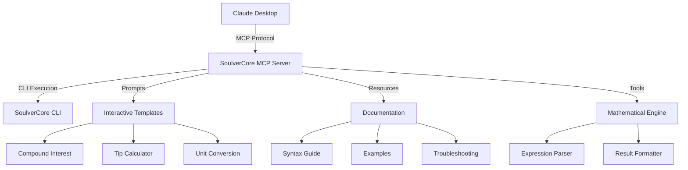

# 🧮 SoulverCore MCP Server

[](https://www.typescriptlang.org/)
[](https://nodejs.org/)
[](https://modelcontextprotocol.io/)
[](https://opensource.org/licenses/MIT)

> **Natural Language Mathematical Expression Evaluation for Claude Desktop**

A comprehensive Model Context Protocol (MCP) server that integrates [SoulverCore](https://soulver.app/core/) with Claude Desktop, enabling powerful natural language mathematical calculations, unit conversions, date arithmetic, and financial computations.

## 🤔 What is Soulver?

[Soulver](https://soulver.app/) is a revolutionary calculator that understands natural language mathematical expressions. Unlike traditional calculators that require precise syntax, Soulver lets you write math the way you think about it:

- **Natural Language**: Write `$25k over 10 years at 7.5%` instead of complex formulas
- **Context Aware**: Understands units, currencies, dates, and percentages automatically
- **Human Readable**: Results are formatted in a way that makes sense to humans
- **Powerful Engine**: Handles complex financial, scientific, and everyday calculations

**SoulverCore** is the command-line version that powers this MCP server, bringing Soulver's natural language math capabilities to Claude Desktop.

## 🧠 Why This Helps Claude with Math

This integration significantly enhances Claude's mathematical capabilities in several key ways:

### **🎯 Precision & Reliability**
- **Eliminates Calculation Errors**: Claude's built-in math can sometimes produce approximations or errors, especially with complex financial calculations. SoulverCore provides precise, reliable results.
- **Consistent Results**: Every calculation is processed by the same proven mathematical engine, ensuring consistency across sessions.

### **🌍 Real-World Context**
- **Natural Language Processing**: Claude can now handle math requests exactly as users write them, without needing to translate to programming syntax.
- **Unit Intelligence**: Automatic handling of currencies, measurements, dates, and percentages without manual conversion.
- **Financial Expertise**: Specialized functions for compound interest, loans, tips, and business calculations that Claude can now access reliably.

### **📚 Enhanced Learning**
- **Syntax Guidance**: The MCP Resources provide Claude with comprehensive documentation about mathematical expression patterns.
- **Error Resolution**: Built-in troubleshooting guides help Claude assist users when calculations don't work as expected.
- **Example Library**: Extensive examples help Claude suggest the right syntax for complex calculations.

### **🔄 Interactive Workflows**
- **Guided Calculations**: MCP Prompts provide structured templates for common calculations, making it easier for Claude to help users step through complex problems.
- **Progressive Assistance**: Claude can start with simple calculations and build up to more complex scenarios using the provided examples.

### **💡 Why This Matters**
Before this integration, Claude might struggle with:
- Complex percentage calculations (`$150 is 25% on what`)
- Financial projections (`$25k over 10 years at 7.5%`)
- Unit conversions with context (`65 kg in pounds`)
- Date arithmetic (`January 30 2020 + 3 months 2 weeks 5 days`)

Now Claude can handle these naturally and accurately, making it a more reliable mathematical assistant for real-world problems.

## ✨ Features

### 🛠️ **MCP Tools**
- **`calculate`** - Evaluate natural language mathematical expressions
- **`soulver_status`** - Check SoulverCore CLI installation and version

### 💬 **MCP Prompts** 
- **`compound_interest`** - Calculate compound interest with guided inputs
- **`tip_calculator`** - Calculate total cost including tips
- **`weight_conversion`** - Convert between weight units
- **`date_addition`** - Add time periods to dates
- **`percentage_calculation`** - Various percentage calculations

### 📚 **MCP Resources**
- **Syntax Guide** - Complete SoulverCore syntax reference
- **Quick Reference** - Common syntax patterns
- **Financial Examples** - Real-world financial calculations
- **Conversion Examples** - Unit conversion examples
- **Date Examples** - Date arithmetic examples
- **Troubleshooting** - Common errors and solutions

## 🚀 Quick Start

### Prerequisites

- **Node.js** 18+ 
- **SoulverCore CLI** - Install with: `brew install soulver-cli`
- **Claude Desktop** with MCP support

### Installation

1. **Clone the repository**
   ```bash
   git clone https://github.com/amotivv/soulver-mcp-server.git
   cd soulver-mcp-server
   ```

2. **Install dependencies**
   ```bash
   npm install
   ```

3. **Build the project**
   ```bash
   npm run build
   ```

4. **Test the server**
   ```bash
   npm test
   ```

### Claude Desktop Configuration

Add the server to your Claude Desktop configuration file:

**macOS**: `~/Library/Application Support/Claude/claude_desktop_config.json`
**Windows**: `%APPDATA%\Claude\claude_desktop_config.json`

```json
{
  "mcpServers": {
    "soulver": {
      "command": "node",
      "args": ["/absolute/path/to/soulver-mcp-server/dist/index.js"]
    }
  }
}
```

> **Important**: Use the absolute path to your project directory.

## 📖 Usage Examples

### Basic Calculations
```
Calculate: $25k over 10 years at 7.5%
→ $51,525.79

Calculate: 65 kg in pounds  
→ 143.3 lb

Calculate: $25/hour * 14 hours of work
→ $350.00
```

### Financial Calculations
```
Calculate: $150 is 25% on what
→ $600.00

Calculate: $10 for lunch + 15% tip
→ $11.50

Calculate: 40 as % of 90
→ 44.44%
```

### Date Arithmetic
```
Calculate: January 30 2020 + 3 months 2 weeks 5 days
→ May 19, 2020

Calculate: 9:35am in New York to Japan
→ 10:35 pm
```

### Unit Conversions
```
Calculate: 32 fahrenheit in celsius
→ 0°C

Calculate: 10 miles in km
→ 16.09 km
```

## 🏗️ Architecture



## 🔧 Development

### Project Structure
```
soulver-mcp-server/
├── src/
│   ├── index.ts              # Main MCP server
│   ├── soulver-cli.ts        # CLI wrapper
│   ├── test.ts               # Test suite
│   ├── prompts/              # MCP prompt definitions
│   │   ├── financial.ts
│   │   ├── conversions.ts
│   │   └── dates.ts
│   └── resources/            # MCP resource definitions
│       ├── syntax-guide.ts
│       └── examples.ts
├── dist/                     # Compiled JavaScript
├── memory-bank/              # Project documentation
├── package.json
├── tsconfig.json
└── README.md
```

### Available Scripts

```bash
npm run build    # Compile TypeScript
npm test         # Run test suite
npm run dev      # Development mode (if configured)
```

### Testing

The project includes a comprehensive test suite that validates:
- ✅ SoulverCore CLI availability
- ✅ Mathematical expression evaluation
- ✅ Error handling and edge cases
- ✅ MCP protocol compliance

```bash
npm test
```

## 📋 Supported Expression Types

### Financial Calculations
- **Compound Interest**: `$25k over 10 years at 7.5%`
- **Hourly Wages**: `$25/hour * 14 hours of work`
- **Tips**: `$10 for lunch + 15% tip`
- **Percentages**: `40 as % of 90`, `$150 is 25% on what`

### Unit Conversions
- **Weight**: `65 kg in pounds`, `150 lbs in kg`
- **Distance**: `10 miles in km`, `5 km in miles`
- **Temperature**: `32 fahrenheit in celsius`, `100 celsius in fahrenheit`

### Date Arithmetic
- **Addition**: `January 30 2020 + 3 months 2 weeks 5 days`
- **Differences**: `December 31 2024 - January 1 2024`
- **Time Zones**: `9:35am in New York to Japan`

### Basic Math
- **Arithmetic**: `100 + 200`, `50% of 200`
- **Currency**: `$100 + $50`, `€200 - €75`

## 🛡️ Security & Error Handling

- **Input Sanitization**: All expressions are validated before execution
- **Process Timeout**: CLI calls timeout after 10 seconds
- **Error Recovery**: Graceful handling of invalid expressions
- **Resource Management**: Proper cleanup of child processes
- **Type Safety**: Full TypeScript implementation with strict mode

## 🤝 Contributing

1. Fork the repository
2. Create a feature branch: `git checkout -b feature/amazing-feature`
3. Commit your changes: `git commit -m 'Add amazing feature'`
4. Push to the branch: `git push origin feature/amazing-feature`
5. Open a Pull Request

## 📄 License

This project is licensed under the MIT License - see the [LICENSE](LICENSE) file for details.

## 🙏 Acknowledgments

- [SoulverCore](https://soulver.app/core/) - The powerful natural language math engine
- [Model Context Protocol](https://modelcontextprotocol.io/) - The protocol enabling AI tool integration
- [Claude Desktop](https://claude.ai/) - The AI assistant platform

## 📞 Support

- **Issues**: [GitHub Issues](https://github.com/amotivv/soulver-mcp-server/issues)
- **Documentation**: [MCP Documentation](https://modelcontextprotocol.io/docs)
- **SoulverCore**: [Official Documentation](https://soulver.app/core/docs)

---

<div align="center">

**Made with ❤️ for the Claude Desktop community**

[⭐ Star this repo](https://github.com/amotivv/soulver-mcp-server) • [🐛 Report Bug](https://github.com/amotivv/soulver-mcp-server/issues) • [💡 Request Feature](https://github.com/amotivv/soulver-mcp-server/issues)

</div>
